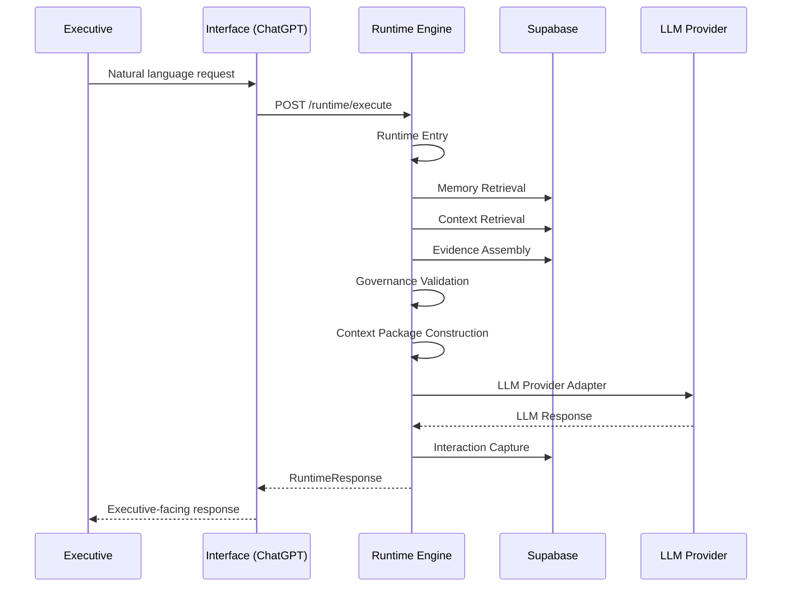

# Runtime Architecture

**Build 13** — ApexOS Runtime Engine foundation.

## Purpose

The Runtime Engine orchestrates executive intelligence. It coordinates the canonical pipeline defined in conceptual architecture (DOC-001 through DOC-009) and assembles the Executive Context Package before LLM invocation.

The runtime is thin. Executive reasoning belongs to the LLM operating on the Context Package.

## Layer Model

```
Executive
    ↓
ChatGPT (interface — future MCP)
    ↓
ApexOS Runtime Engine (this package)
    ↓
Supabase (persistence)
    ↓
Knowledge Repository (content)
```

## Execution Flow



## Folder Structure

```
runtime/
├── src/
│   ├── config.ts                 # Environment configuration
│   ├── index.ts                  # Public exports
│   ├── shared/
│   │   ├── supabase.ts           # Supabase client
│   │   └── errors.ts             # Runtime error types
│   ├── types/                    # TypeScript interfaces
│   ├── pipeline/
│   │   ├── orchestrator.ts       # Pipeline coordinator
│   │   └── stages/               # One module per pipeline stage
│   ├── providers/
│   │   └── llm/                  # LLM provider abstraction
│   ├── server/
│   │   └── http-server.ts        # HTTP API entry point
│   └── cli/
│       └── execute.ts            # CLI for local testing
├── docs/
│   ├── ARCHITECTURE.md           # This document
│   └── MODULES.md                # Module specifications
├── package.json
├── tsconfig.json
└── run.mjs                       # Windows TLS bootstrap
```

## Design Principles

1. **Context precedes reasoning** — Runtime assembles context before LLM invocation
2. **Orchestration, not duplication** — Runtime coordinates; LLM reasons
3. **Provider abstraction** — LLM provider is swappable without changing orchestration
4. **Faithful to architecture** — No redesign of doctrine, database, or layer responsibilities
5. **MVP simplicity** — Working code over enterprise abstractions

## Boundaries

| Runtime owns | Runtime does NOT own |
|--------------|---------------------|
| Pipeline orchestration | Natural language understanding |
| Executive Context Package assembly | Conversational UX |
| Memory/context/evidence retrieval coordination | Evidence selection by LLM |
| Governance validation (structural) | Executive judgment |
| Interaction capture | Outcome validation (deferred) |
| LLM provider adapter | MCP server (Build 14+) |

## Relationship to Existing Code

| Package | Role |
|---------|------|
| `scripts/` | Artifact ingestion runtime (Build 09) — persists pre-authored markdown |
| `apps/executive-ui/` | Executive interface adapter (Build 10/11) — will invoke runtime via HTTP |
| `runtime/` | Intelligence orchestration runtime (Build 13) — live pipeline execution |

The Build 09 ingestion loop remains unchanged. The runtime reads persisted pipeline artifacts from Supabase.
